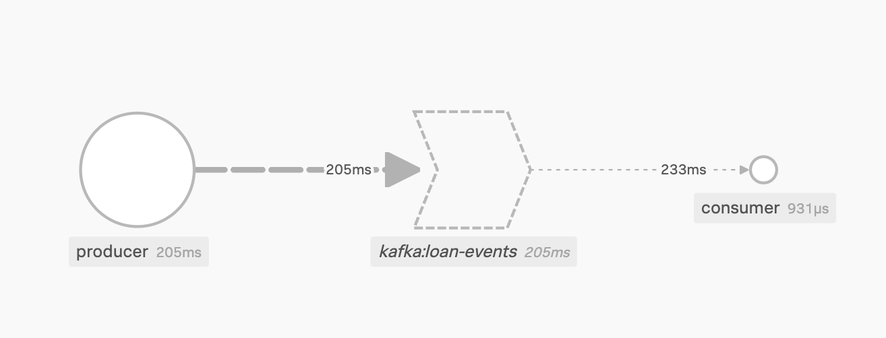
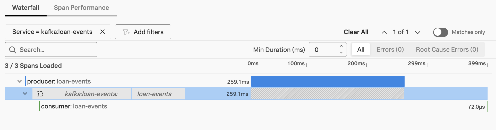

# nodejs-with-kafka

This sample application demonstrates how a kafka consumer and producer
written in node.js can be instrumented with the Splunk distribution
of OpenTelemetry JS.

### Prerequisites

* JDK 17+ (used by Kafka) 
* Kafka 3.8.0+
* Node.js 20.x
* OpenTelemetry collector deployed locally and available at localhost:4317 

### Execution Steps

````
git clone git@github.com:dmitchsplunk/nodejs-with-kafka.git 
cd nodejs-with-kafka

./01_install_jdk_and_kafka.sh
./02_install_nodejs.sh
./03_run_consumer.js
./04_run_producer.js
````

### Expected Output

If everything is working correctly, you should see traces in 
Splunk Observability Cloud such as the following: 




